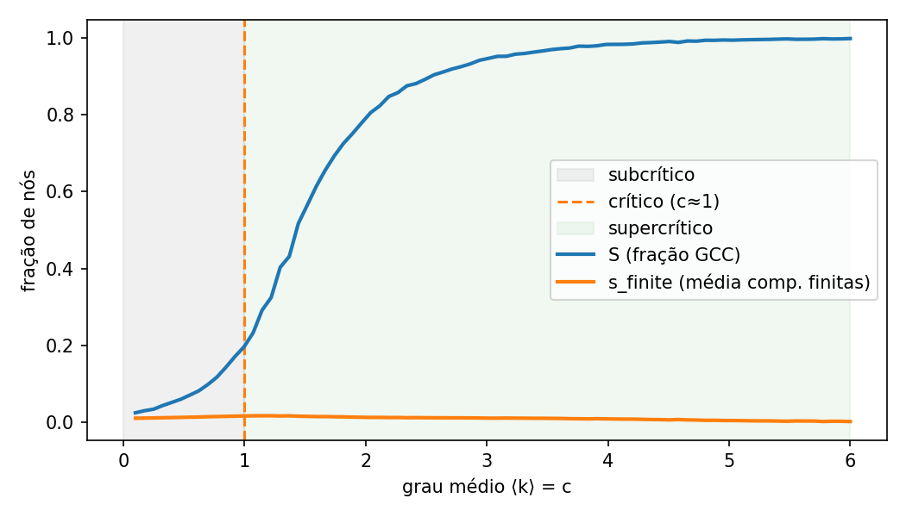
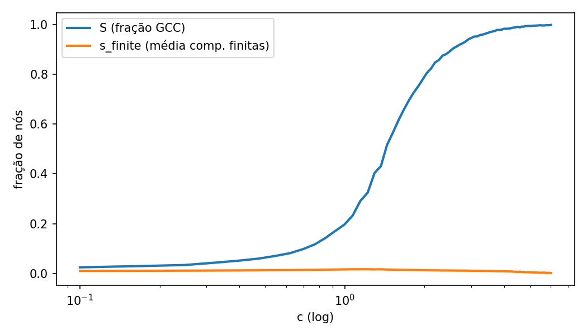
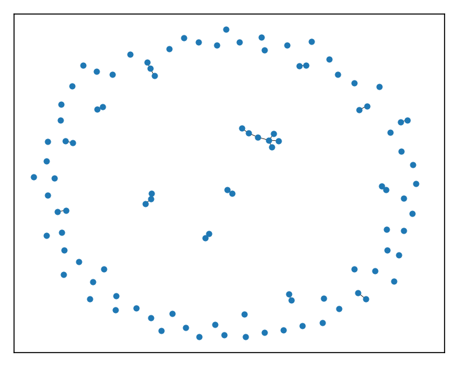
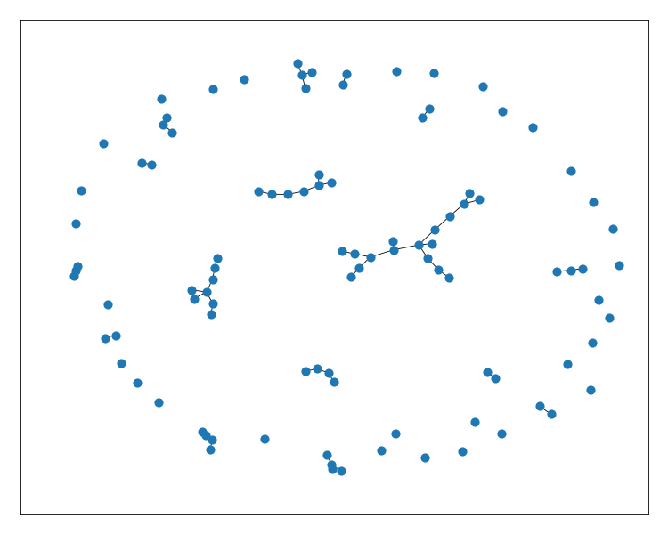
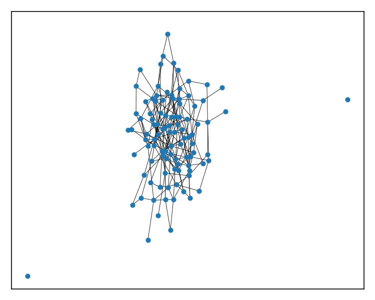

## Explicação simples – ER (sintético) (n=100)

### O que estamos medindo

- grau médio c: variamos este controle e observamos como a rede se conecta.

- S: parte dos nós que ficou na “ilha gigante” (GCC). Vai de 0 a 1.

- s_finite: tamanho médio das outras ilhas (as pequenas componentes).

- Cada ponto é a média de 100 redes/simulações no mesmo valor do controle.

### O que vemos nos gráficos

- “Virada” (início da rede gigante): S passa de ~0 para cima de 0.1 por volta de c≈0.77.

- Rede “quase toda conectada”: S chega perto de 0.9 a partir de c≈2.56.

- s_finite costuma formar um pico perto da virada: as ilhas pequenas se juntam antes de a ilha gigante dominar.

### Dica de leitura

- Ativar escala log no eixo x amplia a região inicial e deixa a transição mais fácil de ver.

- Não usamos log no eixo y porque S é uma fração entre 0 e 1.

### Em uma frase

- A rede quase não tem conexão global, depois “engata” rápido perto do limiar e, em seguida, praticamente todo mundo fica conectado.

### Perguntas e respostas

- Pergunta: “Gere redes ER com n=100, variando ⟨k⟩; estime S.” Resposta: geramos 60 valores de c entre 0.1 e 6.0, com 100–200 amostras por ponto; S(c) e s_finite(c) estão nos gráficos acima.

- Pergunta: “Onde está o ponto crítico e o fim do supercrítico?” Resposta: a virada ocorre por volta de c≈0.77 (S>0.1). Consideramos “supercrítico consolidado” quando S≈0.9, a partir de c≈2.56.

- Pergunta: “Log deixa a transição mais chamativa?” Resposta: sim, log no eixo x enfatiza a vizinhança do limiar.

- Pergunta: “E o tamanho das componentes isoladas?” Resposta: s_finite(c) exibe um pico perto do limiar, indicando coalescência das componentes pequenas.
